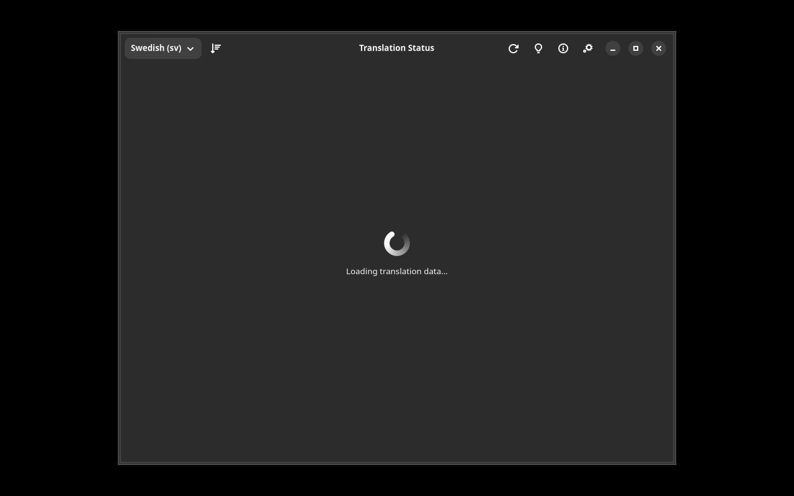

# Translation Status

A GTK4/Adwaita application for viewing elementary OS translation progress via Weblate.



## Features

- Fetches live translation status from a Weblate instance
- Color-coded progress bars (red → yellow → green)
- Language selector with system language auto-detection
- Sort by most/least translated
- Click any component to open it on Weblate
- Info dialog explaining how to contribute translations

## Installation

### Debian/Ubuntu

```bash
# Add repository
curl -fsSL https://yeager.github.io/debian-repo/KEY.gpg | sudo gpg --dearmor -o /usr/share/keyrings/yeager-archive-keyring.gpg
echo "deb [signed-by=/usr/share/keyrings/yeager-archive-keyring.gpg] https://yeager.github.io/debian-repo stable main" | sudo tee /etc/apt/sources.list.d/yeager.list
sudo apt update
sudo apt install elementary-l10n
```

### Fedora/RHEL

```bash
sudo dnf config-manager --add-repo https://yeager.github.io/rpm-repo/yeager.repo
sudo dnf install elementary-l10n
```

### From source

```bash
pip install .
elementary-l10n
```

## 🌍 Contributing Translations

Help translate this app into your language! All translations are managed via Transifex.

**→ [Translate on Transifex](https://app.transifex.com/danielnylander/elementary-l10n/)**

### How to contribute:
1. Visit the [Transifex project page](https://app.transifex.com/danielnylander/elementary-l10n/)
2. Create a free account (or log in)
3. Select your language and start translating

### Currently supported languages:
Arabic, Czech, Danish, German, Spanish, Finnish, French, Italian, Japanese, Korean, Norwegian Bokmål, Dutch, Polish, Brazilian Portuguese, Russian, Swedish, Ukrainian, Chinese (Simplified)

### Notes:
- Please do **not** submit pull requests with .po file changes — they are synced automatically from Transifex
- Source strings are pushed to Transifex daily via GitHub Actions
- Translations are pulled back and included in releases

New language? Open an [issue](https://github.com/yeager/elementary-l10n/issues) and we'll add it!

## License

GPL-3.0-or-later — Daniel Nylander <daniel@danielnylander.se>
